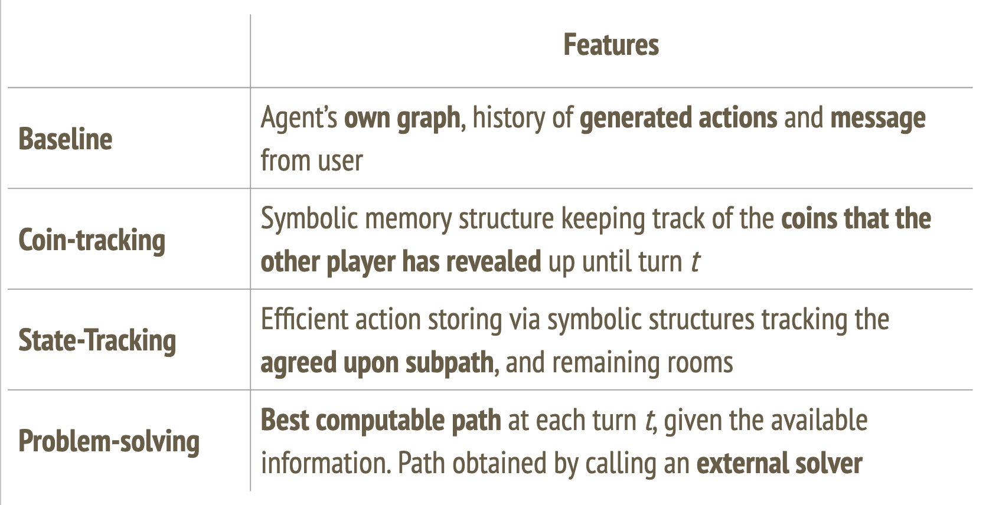

# Collaborative Problem-Solving in an Optimization Game
*This repository is currently being updated!*


*An example view of the ```Traveling Adventurers``` game.*

[ArXiv Preprint](https://arxiv.org/abs/2505.15490)


## Abstract
Dialogue agents that support human users in solving complex tasks have received much attention recently. Many such tasks are NP-hard optimization problems that require careful collaborative exploration of the solution space. We introduce a novel dialogue game in which the agents collaboratively solve a two-player Traveling Salesman problem, along with an agent that combines LLM prompting with symbolic mechanisms for memory, state tracking and problem-solving. Our best agent solves 45% of games optimally in self-play. It also demonstrates an ability to collaborate successfully with human users and generalize to unfamiliar graphs.


## ```Traveling Adventurers```

Our game, ```Traveling Adventurers```, is based on the Traveling Salesman Problem (TSP). It is designed for two (human or artificial) players, who were cursed by an evil wizard and placed in different dimensions (light, ghost) of the same house. They observe the same house layout (nodes, edges), but different amounts of coins (weights) in the hallways between rooms. To break the curse, they must perform a curse-breaking ritual consisting of visiting each room exactly one time and returning to a preset starting room. The coins they collect on the way are summed up and awarded to them as loot after breaking the curse, so they should aim to collect as many along the way.

To access the game, open the ```GAME``` directory and follow the instructions outlined in the **README**.

## Agents
We design 4 agent variants and test them in self-play. The breakdown of agent features can be found below. You can find each agent setup under ```GAME/AGENTS/prompts_{agent-ID}```.


*A preview of the different neurosymbolic agents we designed. For more details, please consult the paper.*


## Reference
If you use our environment or agents, please cite our paper as:

